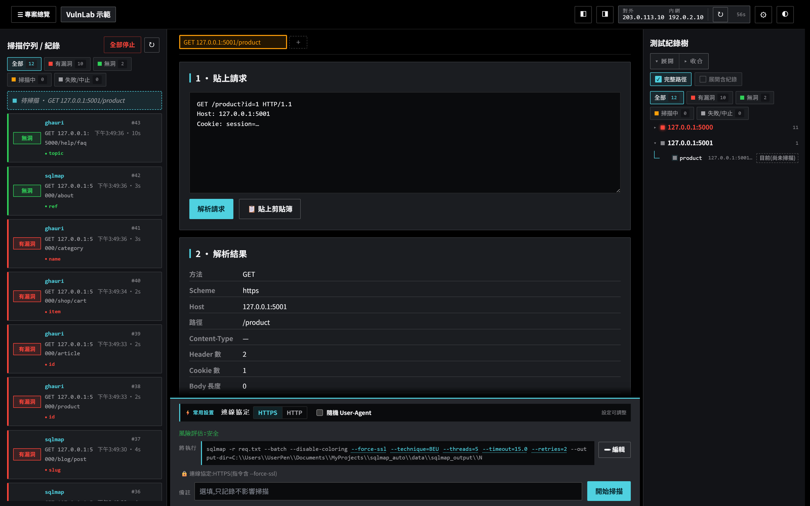
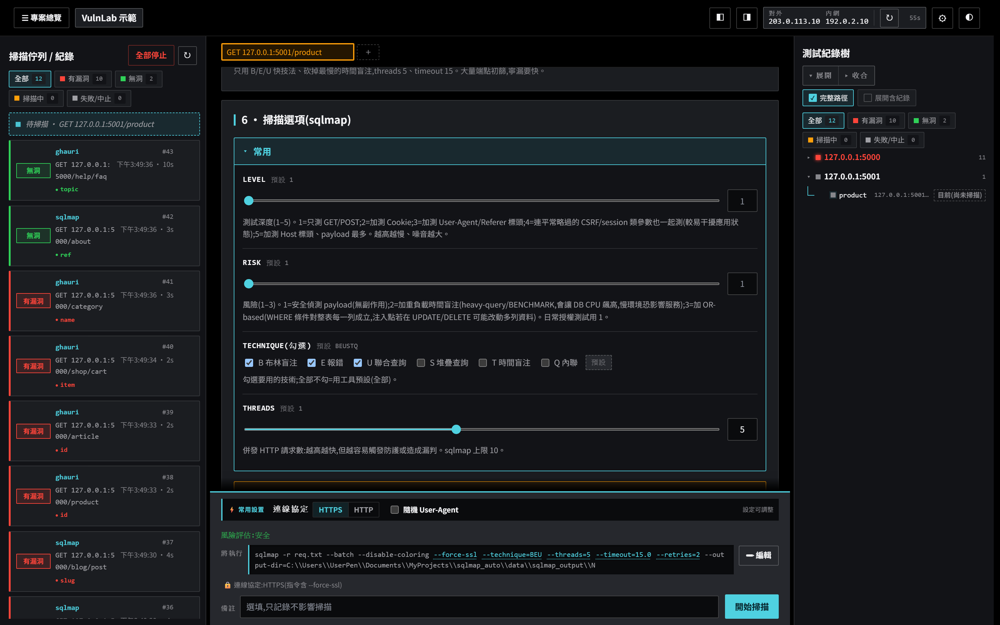
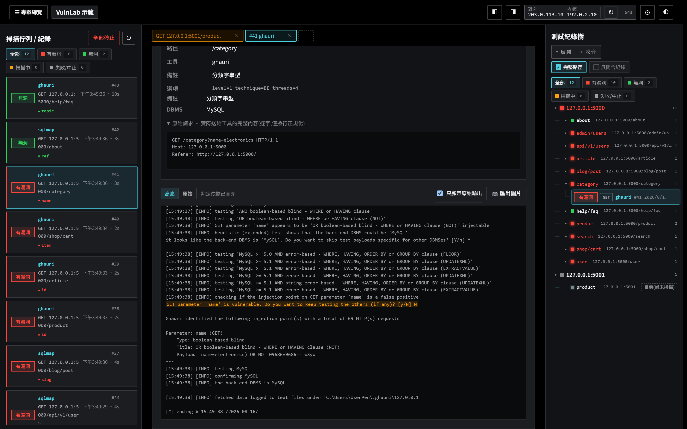
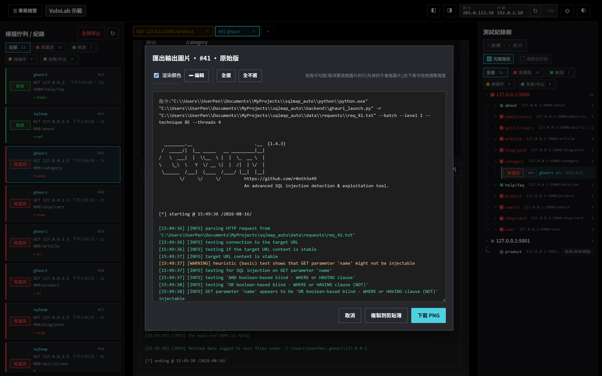

# SQLiScanDeck

繁體中文 · [English](README.en.md)

SQLiScanDeck 是 sqlmap 與 ghauri 的本機圖形介面。貼上一段 HTTP 請求或網址,它會抽出可測參數、在背景併發掃描,並把每次結果存進 SQLite。



> ⚠️ 只對你有書面授權的目標測試。未授權掃描可能違法,後果自負。這是本機工具,預設只綁 `127.0.0.1`、沒有內建帳號認證;不要上傳 `data/`,裡面有真實請求與 cookie。

需求:Windows 10/11,首次啟動需要連網。不會動到系統的 Python。

## 安裝

**雙擊 `start.bat` 就好。** 第一次會連網,自動把 [uv](https://docs.astral.sh/uv/)、一份專用 Python、相依套件與 sqlmap/ghauri 全部裝進專案資料夾(只有第一次),然後開瀏覽器到 `http://127.0.0.1:8776`。

- **完全自包**:所有東西都在資料夾內,不改系統、不改 PATH。刪掉資料夾 = 系統零殘留。
- **搬到另一台**:整包複製過去(含 `uv.lock`),`start.bat` 會依 lock 還原一模一樣的環境。掃描歷史與分頁存在 `data/`,跟著搬也還在。
- **內網 / 連不到 GitHub**:見下方「手動安裝」。

## 試玩

專案內附一個練習靶機,可以零風險先跑一輪。

```
.venv\Scripts\python testlab\vuln_server.py   # 故意有洞的靶機,綁 127.0.0.1:5000(先跑過一次 start.bat)
```

在介面貼上 `http://127.0.0.1:5000/product?id=1`,選工具,按「開始掃描」。約幾秒後佇列會亮紅燈(有洞),點進去看即時 log、判定依據與 payload。

另有一個 MySQL / MariaDB 版靶機:雙擊 `testlab\start_mysql_lab.bat`,綁 `127.0.0.1:5001`。兩個靶機都故意有洞,只能綁本機,絕不可對外。

## 使用步驟

1. 貼上原始請求或網址,按「解析請求」。參數分三區:主參數(預設勾選)、Header、自動略過。
2. 選工具:sqlmap 或 ghauri。
3. 選模式:基本掃描是套範本、唯讀顯示;進階掃描可改所有選項。
4. 需要時在底部「常用設置」改協定(HTTP / HTTPS)、隨機 User-Agent 等常改的設定;想直接改整條指令就按「編輯」。
5. 按「開始掃描」。左邊佇列看狀態顏色,點一筆看即時 log,右側紀錄樹會累積歷史。

## 功能

- 貼上請求或網址,自動抽出 GET / POST / JSON / Cookie / Header 參數。
- 內建雜訊過濾(GA、FB pixel、CSRF、ViewState 等),命中的預設不勾,可手動勾回。
- 掃描在背景併發執行,不會卡住畫面。狀態用顏色分:紅=有洞、綠=沒洞、橘=掃描中、灰=中止或其他。
- 底部「將執行」顯示實際會跑的指令。這串預覽和真正送出的完全一致,因為前端和後端共用同一份組指令的程式碼。
- 每次掃描的指令、log、結果都存進 SQLite。重測同一個端點時會提醒你「測過 / 曾有漏洞」。
- 掃描詳情的 log 可切高亮或原始輸出,也可以匯出成 PNG 貼進報告。
- 右側測試紀錄樹用路徑階層排列,可依掃描結果篩選。
- 不同目標可以分成專案;編排分頁存進資料庫,換機器整包搬也還在。

## 授權與安全

授權採 [GNU AGPL-3.0](LICENSE)(著作權 © 2026 kunjitw)。可自由使用、研究、修改;但任何修改版、散布版,或架設為網路服務的版本,都必須同樣以 AGPL 授權開源並保留原作者署名,不得改為專有(閉源)軟體再行散布。

- 只對有明確書面授權的目標測試。未授權掃描依當地法律可能觸法。
- 預設只綁 `127.0.0.1`、沒有內建認證。若改綁對外,請自行加上存取控制。
- 不要上傳 `data/`,裡面有真實請求、cookie 和 log。`.gitignore` 已排除 `data/`、`python/`、`tools/`。
- `testlab/` 的靶機故意有洞,只能綁本機。
- 本專案編排 [sqlmap](https://github.com/sqlmapproject/sqlmap)(GPLv2)與 [ghauri](https://github.com/r0oth3x49/ghauri)(MIT),以獨立子程序執行,由 `bootstrap` 從官方取得,不隨附於本專案。

<details>
<summary>📸 畫面預覽</summary>

請求編排:選工具、模式、範本、選項,底部是常用設置與實際會執行的指令。



掃描詳情:判定依據、每個參數的結果、原始請求,以及可切高亮或原始的即時 log。



匯出圖片:拖曳選要的行、可開關顏色、可編輯,存成 PNG 或複製到剪貼簿。



</details>

<details>
<summary>🧠 三個要知道的觀念</summary>

- 簽名去重只影響「顯示」。路徑裡的 id 會正規化成 `{id}`,只是用來分組歷史和畫樹;實際送測的是你貼的原文,路徑不會被改。
- 過濾規則只是幫你取消勾選,隨時可以手動勾回。session id、Authorization、第一方 cookie 這類灰色地帶預設停用,亂測可能弄壞你的登入狀態。
- 範本就是一組掃描選項,依工具分開存。設為預設後,每次會自動帶入。

</details>

<details>
<summary>⚙️ 設定</summary>

| 項目 | 說明 |
|---|---|
| 同時併發掃描數 | 背景同時可跑幾筆(預設 3,改後需重啟) |
| Web 埠 | 預設 8776(改後需重啟) |
| 預設掃描工具 | 載入時預選 sqlmap 或 ghauri |
| 預設掃描模式 | 每次開啟預設基本或進階 |
| 常用設置(釘選) | 哪些設定顯示在指令上方的快速列(預設:強制 HTTPS、隨機 User-Agent) |
| 詳情預設 log 視圖 | 打開掃描詳情時預設高亮或原始 |
| IP 自動刷新(秒) | 頁首 IP 徽章更新間隔 |
| 嘗試顯示公網 IP | 關掉可在內網更快(會連 ipify 等第三方) |
| 啟動時自動開瀏覽器 | — |

</details>

<details>
<summary>🏗️ 架構</summary>

```
backend/   FastAPI 後端,跑在 uv 建立的 .venv 上
  app.py            API 路由、靜態前端、/api/preview 指令預覽、回環位址閘門
  scan_manager.py   併發佇列、即時 log 串流、持久化、強停與刪除
  drivers/          sqlmap / ghauri 雙驅動,build_args 是唯一的組指令來源
  db.py             SQLite:專案、掃描、參數歷史、規則、範本、分頁
  request_parser.py / filters.py / signature.py / ip_utils.py / config.py
web/       單頁前端(index.html / style.css / app.js,無框架)
testlab/   vuln_server.py 與 vuln_mysql_server.py,兩個練習靶機,只綁 127.0.0.1
pyproject.toml / uv.lock                     相依與環境的單一真相(uv.lock 進版控)
.venv/ .tools/ .python-managed/ .uv-cache/   uv 建立的自包環境(.gitignore)
tools/     sqlmap / ghauri 原始碼(.gitignore)
data/      執行時建立:DB、logs/、requests/、settings.json(.gitignore)
```

- 兩個引擎都以獨立子程序執行,用 `-r <原始請求檔>` 送測,測的就是你貼的原文。
- 前端的指令預覽和實際執行共用後端的 `build_args()`,不會各寫一套而分歧。
- 原始請求、分頁內容等敏感欄位,只在綁 `127.0.0.1 / localhost / ::1` 時才回傳。
- 強制停止會先真的殺掉引擎程序,才標記為 killed。

</details>

<details>
<summary>🔧 手動安裝(內網或無法 bootstrap 時)</summary>

**最省事**:在一台有網路的機器雙擊一次 `start.bat`,再把**整個資料夾**複製到內網機器 —— 因為全自包,直接 `start.bat` 就能跑,不必再連網。

要手動湊也行:
1. 把 `uv.exe` 放到 `.tools\`(或設環境變數 `SQLISCANDECK_UV_SRC` 指到共享資料夾裡的 `uv.exe`,`start.bat` 會自己複製)。
2. 把 sqlmap 原始碼放到 `tools\sqlmap\`(要有 `sqlmap.py`、`sqlmapapi.py`)。
3. 把 ghauri 原始碼放到 `tools\ghauri\`(要有 `ghauri\scripts\ghauri.py`)。
4. 執行 `start.bat`。它會用 `uv.lock` 還原 Python 與相依(這步仍需能取得 Python 與套件;完全離線就用上面「整包複製」)。

</details>

<details>
<summary>❓ 常見問題</summary>

- 第一次啟動很慢:正在下載 uv、Python 與套件,只有第一次;之後就快了。要完全離線請看「手動安裝」的整包複製法。
- 引擎燈是紅的:`tools\sqlmap` 或 `tools\ghauri` 沒就緒,重跑 `bootstrap.bat`(它只補這兩個引擎)。
- 指令預覽是空的或有誤:後端有更新,重啟 server 再硬刷新。
- 在專案內按 F5:會留在該專案,不會跳回列表。
- MySQL 靶機開不起來:首次需連網下載 MariaDB;卡住就 `stop_mysql_lab.bat` 後重跑 `start_mysql_lab.bat`。
- IP 顯示「未能偵測」:代表這台連不到外網,不影響掃描,可到設定關掉公網查詢。
- 改了併發數或埠沒生效:需要重啟。

</details>
