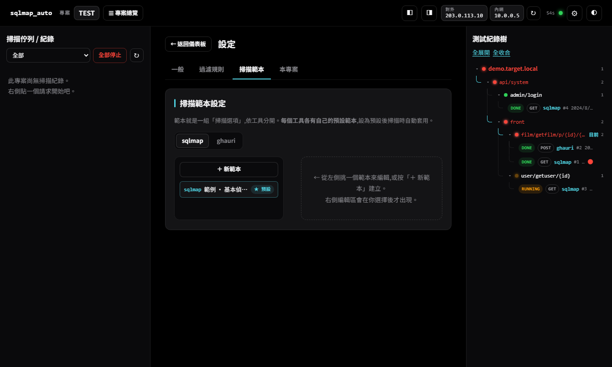

<div align="center">

# SQLiScanDeck · sqlmap_auto

**一個可攜帶的 SQL Injection 測試駕駛艙 —— 貼上請求、勾選參數、併發跑 sqlmap / ghauri,全程入庫與歷史去重。**
*A portable cockpit for SQL-injection testing — paste a request, pick parameters, run sqlmap / ghauri concurrently, with full history & dedup.*

[中文說明](#中文) · [English](#english)

</div>

---

<a name="中文"></a>

## 中文

### 這是什麼

SQLiScanDeck 是 **sqlmap** 與 **ghauri** 的圖形化「駕駛艙」。你只要把 Burp 的原始 HTTP 請求(或一個 URL)貼進去,它會自動抽出所有可測參數、把已知的雜訊(追蹤 cookie、CSRF token、ViewState…)預設不勾,讓你一鍵開始背景併發掃描;所有過程、結果、耗時都入庫,並在你重測到同一個 API 時提醒「這個測過了、哪些參數測過、有沒有洞」。

- **不用裝環境**:`bootstrap.bat` 會下載一份**內嵌可攜帶 Python**,連 sqlmap / ghauri 都放在資料夾裡,整包可直接複製到別台機器。
- **不碰系統 Python**:所有子程序(sqlmap REST API、ghauri)都用內嵌 Python 執行。
- **本機工具**:預設只綁 `127.0.0.1`,是給你自己用的本機操作台。

### 畫面

|  |  |
|:--:|:--:|
| **主畫面 + 測試紀錄樹**<br> | **解析結果(參數分三區)**<br> |
| **過濾規則(全域 / 本專案)**<br> | **掃描範本(依工具分頁)**<br> |

> 截圖中的 IP 與目標皆為示意(文件用保留位址 `203.0.113.10` / `10.0.0.5`、假域名 `demo.target.local`)。

### 主要功能

| 你想做的事 | 在哪裡 / 怎麼運作 |
|---|---|
| 貼請求就好,不用建 txt / 打參數 | 首頁大文字框,支援 Burp 原始請求或裸 URL;**📋 貼上剪貼簿**可一鍵貼上並解析。自動抽出 GET / POST / JSON / Cookie / Header 參數 |
| 只測想測的參數 | 參數表格勾選,對應工具的 `-p` / `--skip`;顏色跟著勾選狀態走(勾=會測、不勾=淡色) |
| Header 型注入點分開看 | User-Agent、Referer 等 **Header 參數獨立成一區**(較少見的注入點,預設不勾) |
| 自動略過不用測的雜訊 | 內建 **50 條過濾規則**(GA `_ga*`、FB pixel、CSRF/nonce/captcha、ViewState…),命中就自動不勾,收在「已自動略過」獨立區塊 |
| 規則自己管 | ⚙ 設定 → 過濾規則,分 **全域** / **本專案** 兩頁;可依名稱或值、用開頭/包含/等於/正規表達式比對;可停用內建規則 |
| 併發測試、不阻塞 | 背景執行緒池(預設 8),多開不用等前一個跑完;左側佇列/看板即時顯示狀態色 |
| 掃描狀態一眼看懂 | 灰=未測、綠=測過無洞、橘=掃描中、紅=有漏洞;同一路徑多筆結果取**最嚴重** |
| 完整記錄與即時 log | 每筆掃描存工具、指令、選項、即時串流 log、DBMS/payload、開始/結束/耗時,存 SQLite + log 檔 |
| 重測到同 API 會提醒 | 解析時比對**端點簽名**(路徑中的 id 正規化),顯示「測過 N 次 / 曾有漏洞」與每個參數的過去狀態 |
| 測試紀錄樹 | 右側以**路徑階層**呈現(VSCode 式:共用前綴自動群組、單鏈合併),GET/POST 同路徑歸在一起;可展開看每筆掃描、就地刪除 |
| 掃描範本 | ⚙ 設定 → 掃描範本,分 **sqlmap / ghauri** 兩頁,**各自可設預設**;掃描時在儀表板一鍵套用 |
| 專案分類 | 頁首專案下拉;「＋ 建立新專案」跳彈窗;掃描歸屬專案 |
| 兩款工具擇一或對照 | 每筆掃描選 sqlmap 或 ghauri |
| 固定顯示 IP,內網不崩 | 頁首 IP 徽章,多層 fallback(對外→主機名→網卡→「未能偵測」);公網查詢失敗只降級 |
| 深/淺色 + 動效 | 右上切換,主題以點擊點圓形擴散;全站進場/過場動畫,並支援 `prefers-reduced-motion` |

### 快速開始

1. 連網執行一次 **`bootstrap.bat`**(下載可攜帶 Python + sqlmap + ghauri,約數分鐘)。
2. 之後每次雙擊 **`start.bat`**,會自動開瀏覽器到 `http://127.0.0.1:8776`。
3. 依下方教學使用。

> 內網 / 離線:把同事已 bootstrap 好的整個資料夾複製過來即可(它是可攜帶的)。

### 使用教學(逐步)

1. **建立專案** — 首次啟動會跳「建立新專案」彈窗;之後可用頁首「☰ 專案總覽 → ＋ 建立新專案」。掃描都會歸屬目前專案。
2. **貼上請求** — 在「1 · 貼上請求」貼 Burp 原始請求或一個 URL;或按 **📋 貼上剪貼簿**(貼上並自動解析)。
3. **解析** — 按「解析請求」。會列出偵測到的參數:
   - **主參數**(GET/POST/JSON/Cookie 候選)預設勾選;
   - **Header 位置參數** 與 **已自動略過** 各自收在下方獨立區塊,需要再展開勾回。
4. **選工具與選項** — 在「3 · 工具與掃描選項」選 sqlmap 或 ghauri;可**套用範本**或手動調 level / risk / technique / tamper…。
5. **開始掃描** — 按「開始掃描」。它背景執行、不阻塞,你可以立刻貼下一個。
6. **即時監控** — 左側佇列即時顯示狀態色;點任一筆開詳情視窗看**即時 log**、findings,並可**中止**或**刪除**。
7. **看歷史** — 右側「測試紀錄樹」以路徑階層累積;重測到同端點時,解析結果會標「測過 / 曾有漏洞」。

### 核心概念

- **端點簽名 / 去重**:把 URL 路徑中的 id(純數字、UUID、長 hash、數字占比高的 token)正規化成 `{id}`,所以 `/user/1` 和 `/user/2` 視為同一端點形狀來累積歷史。**注意:這只影響歷史分組與樹的標籤,實際送測的是你貼上的原始請求(路徑原封不動)。**
- **過濾規則只是「取消勾選」**:命中規則的參數只是預設不勾,你隨時可手動勾回。部分灰色地帶規則(session id、Authorization、Google/FB 第一方 cookie)**預設停用**,因為亂測可能弄壞你的 session,交給你決定。
- **範本 = 一組掃描選項**,依工具分開;每個工具各有一個預設,設為預設後每次自動帶入。

### 架構

```
sqlmap_auto/
├─ start.bat / bootstrap.bat / bootstrap.ps1
├─ python/            ← 內嵌可攜帶 Python(bootstrap 下載;.gitignore)
├─ tools/
│   ├─ sqlmap/        ← sqlmap 原始碼(含 REST API sqlmapapi.py;.gitignore)
│   └─ ghauri/        ← ghauri 原始碼(.gitignore)
├─ backend/           ← FastAPI 後端(跑在內嵌 python 上)
│   ├─ app.py             ← API 路由 + 靜態前端
│   ├─ scan_manager.py    ← 併發/佇列、sqlmap REST 伺服器、即時 log、持久化、強停/刪除
│   ├─ drivers/           ← sqlmap(REST API)/ ghauri(子程序)雙驅動 + 共用解析
│   ├─ db.py              ← SQLite 資料層(專案/掃描/參數歷史/規則/範本)
│   ├─ request_parser.py  ← 原始請求 → 結構化 + 參數抽取
│   ├─ filters.py         ← 過濾規則引擎 + 50 條內建預設
│   ├─ signature.py       ← 端點簽名(去重/歷史)
│   ├─ ip_utils.py / config.py
│   └─ requirements.txt
├─ web/               ← 單頁前端(index.html / style.css / app.js,無框架)
└─ data/              ← 執行時建立:sqlmap_auto.db、logs/、requests/、settings.json(.gitignore)
```

**執行模型**
- **sqlmap**:惰性啟動一次它內建的 REST API(`sqlmapapi.py -s`),每筆掃描是引擎內獨立 task/程序,天生併發;後端輪詢 `log`/`status`,結束讀 `data` 取結構化結果。
- **ghauri**:沒有 API,以內嵌 python 執行其原始碼、背景執行緒即時串流 stdout。
- 兩者送測都用 `-r <原始請求檔>`(**測的就是你貼的原文**,解析只用來挑參數/去重)。
- **強制停止**是合作式(threading.Event):先真的殺掉引擎程序,才標記為 killed。

### 設定(⚙)

| 項目 | 說明 |
|---|---|
| 同時併發掃描數 | 執行緒池大小(改後需重啟) |
| Web 埠 | 預設 8776(改後需重啟) |
| IP 自動刷新(秒) | 頁首 IP 徽章更新間隔 |
| 嘗試顯示公網 IP | 關掉可在內網更快(公網查詢會連 ipify 等第三方) |
| 啟動時自動開瀏覽器 | — |

### 手動安裝(內網 / 無法 bootstrap)

1. 把可攜帶 Python 放到 `python\`,`python\python.exe -m pip install -r backend\requirements.txt`。
2. 把 **sqlmap 原始碼**放到 `tools\sqlmap\`(要有 `sqlmapapi.py`)。
3. 把 **ghauri 原始碼**放到 `tools\ghauri\`,並補其相依:
   `pip install tldextract colorama requests chardet ua_generator`。
4. 執行 `start.bat`(或 `python backend\app.py`)。

### 安全、授權與隱私

- **僅供授權範圍內**的滲透測試 / 安全研究。請只對你有明確書面授權的目標使用,並遵守測試 IP 限制與規範。
- **本機工具**:預設只綁 `127.0.0.1`。若你改綁 `0.0.0.0` 對外,請自行加上存取控制——本服務**沒有內建認證**。
- **不要把 `data/` 上傳**:裡面有你實際掃描過的目標、`data/requests/` 的原始請求(含 cookie / Authorization / session)與引擎 log。專案已用 `.gitignore` 排除 `data/`、`python/`、`tools/`。

### 常見問題

- **sqlmap 引擎燈是紅的** → `tools\sqlmap` 尚未就緒,重跑 `bootstrap.bat`。
- **IP 顯示「未能偵測」** → 無法對外的環境(預期行為,不影響掃描);可到設定關掉公網查詢。
- **改併發數 / 埠沒生效** → 這兩項需重啟。
- **刪除 / 新規則沒反應** → 後端相關功能需重啟 server 生效;前端改動 `Ctrl+F5`。

### 授權 / 第三方

本專案自身的 wrapper 程式碼採 **MIT**(見 [`LICENSE`](LICENSE))。它**編排**兩個外部工具(以獨立程序執行),各自遵循其授權:
- [sqlmap](https://github.com/sqlmapproject/sqlmap)(GPLv2)
- [ghauri](https://github.com/r0oth3x49/ghauri)(見其 repo 授權)

這些工具由 `bootstrap` 從官方來源取得,不隨本 repo 散布。

---

<a name="english"></a>

## English

### What it is

SQLiScanDeck is a graphical **cockpit for sqlmap and ghauri**. Paste a raw Burp HTTP request (or a URL); it extracts every testable parameter, auto-unchecks known noise (tracking cookies, CSRF tokens, ViewState…), and lets you launch concurrent background scans in one click. Every run — options, live log, findings, timing — is stored, and when you revisit the same API it tells you *"tested N times / was vulnerable"*.

- **No environment setup**: `bootstrap.bat` downloads an **embedded portable Python** plus sqlmap & ghauri into the folder; the whole thing is copy-portable.
- **Never touches system Python**: all subprocesses run on the embedded interpreter.
- **Local tool**: binds `127.0.0.1` by default — it's your personal console.


*(More screenshots — dashboard param regions, filter rules, templates — are in the 中文 section above. IPs and targets shown are illustrative placeholders.)*

### Highlights

- **Paste & parse** a Burp request or URL (or **📋 paste from clipboard**, which parses too); auto-extracts GET / POST / JSON / Cookie / Header params.
- **Pick what to test** with checkboxes (maps to `-p` / `--skip`); row colour follows the checkbox.
- **Separate regions** for *Header-location params* (uncommon injection points, off by default) and *auto-skipped noise*.
- **50 built-in filter rules** (analytics, pixels, CSRF/nonce/captcha, ViewState…), manageable under **Global / This-project** tabs.
- **Concurrent, non-blocking** scans (thread pool, default 8) with a live status board; colour = grey (untested) / green (clean) / orange (running) / red (vulnerable), worst-of aggregated per path.
- **Full records + live log** per scan; **force-stop** and **delete** supported.
- **Dedup / history** via endpoint signatures (path ids normalised to `{id}`) — *display/grouping only; the engine always tests your original request*.
- **Path-based record tree** (VSCode-style nesting with single-chain compaction; GET/POST of the same path stay together).
- **Scan templates** per tool (sqlmap / ghauri), each with its own default.
- **Projects**, dark/light theme with a circular reveal, tasteful motion (respects `prefers-reduced-motion`).

### Quick start

1. Run **`bootstrap.bat`** once (online) to fetch portable Python + sqlmap + ghauri.
2. Double-click **`start.bat`**; it opens `http://127.0.0.1:8776`.
3. Create a project → paste a request → Parse → pick params → choose a tool → Start scan → watch the live log → review the record tree.

### Architecture (short)

FastAPI backend serving a no-framework SPA, on an embedded portable Python; SQLite for state. **sqlmap** runs via its built-in REST API (one task/process per scan → concurrency); **ghauri** runs as a subprocess with streamed stdout. Both are fed the original request via `-r`. Force-stop is cooperative (kills the engine, *then* marks killed).

### Security, authorization & privacy

- **Authorized testing only.** Use only against targets you have explicit written permission to test.
- **Local tool, no built-in auth.** If you rebind to `0.0.0.0`, add your own access control.
- **Never publish `data/`** — it holds your real targets, raw requests (cookies / Authorization / session), and engine logs. `.gitignore` already excludes `data/`, `python/`, and `tools/`.

### Third-party

SQLiScanDeck *orchestrates* external tools under their own licenses: [sqlmap](https://github.com/sqlmapproject/sqlmap) (GPLv2) and [ghauri](https://github.com/r0oth3x49/ghauri). They are fetched by `bootstrap` from official sources and are **not** redistributed in this repo.
