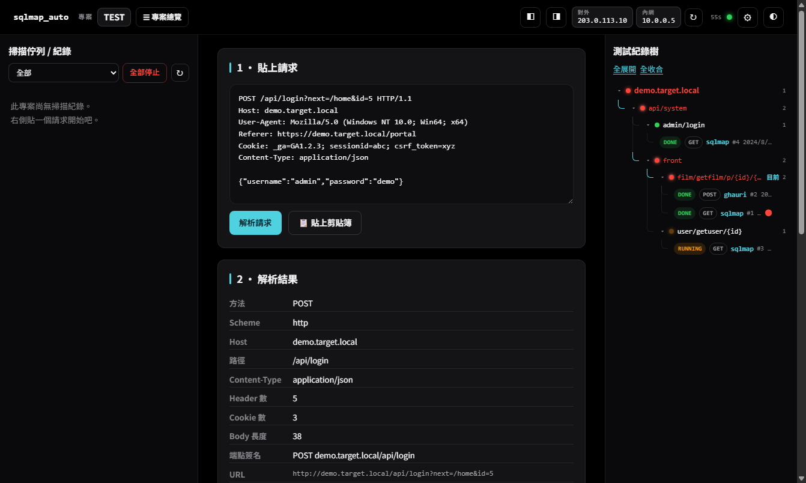
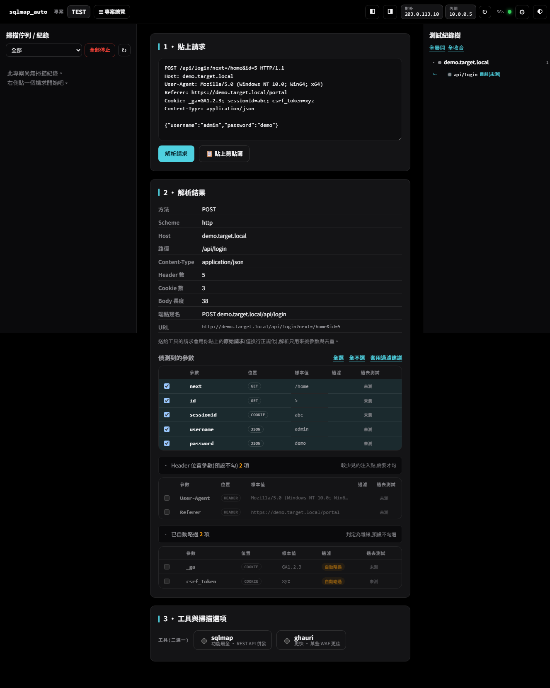
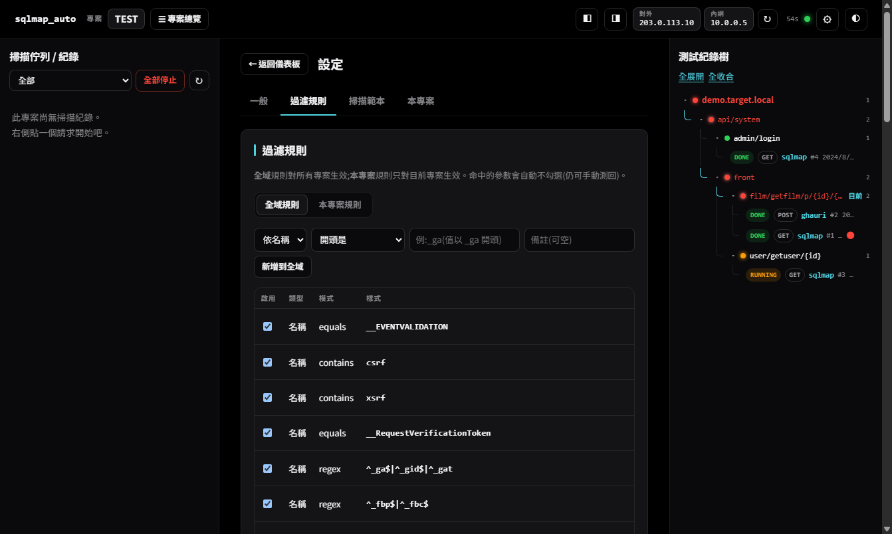

<div align="center">

# SQLiScanDeck

**貼上請求 → 勾參數 → 併發跑 sqlmap / ghauri**
一個可攜帶、全程入庫、歷史去重的 SQL Injection 測試駕駛艙。



</div>

## ⚡ 30 秒看懂

- **這是什麼**:**sqlmap + ghauri** 的圖形操作台。貼一個 Burp 請求或 URL,它幫你**抽參數、濾雜訊、背景併發掃描、記錄歷史**。
- **免裝環境、點兩下就開**:雙擊 `bootstrap.bat`(首次下載)→ `start.bat`(啟動),詳見下方〈安裝與啟動〉。
- 不碰系統 Python、預設只綁 `127.0.0.1`(本機自用)。

> ⚠️ **只對你有書面授權的目標使用。** 本機工具、**無內建認證**;**別把 `data/` 上傳**(裡面有真實請求,含 cookie / session)。

## 🛠️ 安裝與啟動

**不用開終端機、不用裝 Python —— 只有兩個檔要點兩下:**

1. **第一次**:連上網路,**雙擊 `bootstrap.bat`**
   → 自動下載內嵌 Python + sqlmap + ghauri(約數分鐘,只需這一次)。
2. **之後每次**:**雙擊 `start.bat`**
   → 啟動服務並自動開瀏覽器到 **`http://127.0.0.1:8776`**。

> 📦 整包**可攜帶**:複製到別台**已 bootstrap 過**的機器,直接 `start.bat` 就能用(免再下載)。
> 🔌 內網 / 離線無法下載時:把同事已 bootstrap 好的整包複製過來即可;完全手動安裝見下方〈手動安裝〉摺疊。

## 🚀 七步教學

1. **建立專案** — 首次啟動跳彈窗;之後用頁首 **`☰ 專案總覽 → ＋ 建立新專案`**。
2. **貼上請求** — 貼 Burp 原文或 URL;或按 **`📋 貼上剪貼簿`**(貼上並自動解析)。
3. **解析** — 按 **`解析請求`**。參數分三區:**主參數**(預設勾)、**Header**、**已自動略過**(後兩區收合,需要再展開)。
4. **選工具** — 選 **sqlmap** 或 **ghauri**;可**套用範本**或手動調 level / risk / technique / tamper。
5. **開始掃描** — 按 **`開始掃描`**。背景執行、不阻塞,可立刻貼下一個。
6. **即時監控** — 左側佇列顯示狀態色;點一筆看**即時 log**,可**中止**或**刪除**。
7. **看歷史** — 右側「測試紀錄樹」以路徑階層累積;重測同端點會標「測過 / 曾有漏洞」。

## 🖼️ 畫面

| 解析結果(參數分三區) | 過濾規則(全域 / 本專案) |
|:--:|:--:|
|  |  |

> 截圖 IP 與目標皆為示意(保留位址 `203.0.113.10`、假域名 `demo.target.local`)。

## ✨ 主要功能

- **貼上就解析**:Burp 原文或 URL → 自動抽 GET / POST / JSON / Cookie / Header 參數。
- **雜訊自動略過**:內建 **50 條過濾規則**(GA、FB pixel、CSRF、ViewState…),命中的預設不勾。
- **參數分區**:主參數 / Header / 已略過各自一區;顏色跟著勾選走。
- **併發、不阻塞**:背景執行緒池(預設 8),狀態色一眼看懂(灰=未測、綠=無洞、橘=掃描中、紅=有洞)。
- **完整記錄**:工具、指令、選項、即時 log、DBMS/payload、耗時,全存 SQLite。
- **歷史去重**:端點簽名把路徑 id 正規化,重測同 API 會提醒。
- **測試紀錄樹**:VSCode 式路徑階層(共用前綴群組、GET/POST 同路徑歸一起),可展開看每筆、就地刪除。
- **範本**:sqlmap / ghauri 各自分頁、各自預設,一鍵套用。
- **深/淺色 + 動效**,主題圓形擴散切換,支援 `prefers-reduced-motion`。

## 🧠 三個要知道的觀念

- **簽名去重只影響「顯示」**:路徑 id 正規化成 `{id}` 只是用來分組歷史/畫樹;**實際送測的是你貼的原文,路徑原封不動。**
- **過濾規則只是取消勾選**:隨時可手動勾回。灰色地帶規則(session id、Authorization、Google/FB 第一方 cookie)**預設停用**,因為亂測可能弄壞你的 session。
- **範本 = 一組掃描選項**,依工具分開,設為預設後每次自動帶入。

## 🔒 安全・授權

- **僅供授權範圍內**的測試;只對有明確書面授權的目標使用。
- **無內建認證**:若改綁 `0.0.0.0` 對外,請自行加存取控制。
- **`data/` 不要上傳**(含真實請求 / cookie / log);`.gitignore` 已排除 `data/`、`python/`、`tools/`。
- wrapper 程式碼採 **MIT**([`LICENSE`](LICENSE));編排 [sqlmap](https://github.com/sqlmapproject/sqlmap)(GPLv2)與 [ghauri](https://github.com/r0oth3x49/ghauri),以獨立程序執行、由 `bootstrap` 從官方取得。

---

<details>
<summary>⚙️ <b>設定</b></summary>

| 項目 | 說明 |
|---|---|
| 同時併發掃描數 | 執行緒池大小(**改後需重啟**) |
| Web 埠 | 預設 8776(**改後需重啟**) |
| IP 自動刷新(秒) | 頁首 IP 徽章更新間隔 |
| 嘗試顯示公網 IP | 關掉可在內網更快(會連 ipify 等第三方) |
| 啟動時自動開瀏覽器 | — |

</details>

<details>
<summary>🏗️ <b>架構與執行模型</b></summary>

```
backend/   FastAPI 後端(跑在內嵌 python 上)
  app.py            API 路由 + 靜態前端
  scan_manager.py   併發/佇列、sqlmap REST 伺服器、即時 log、持久化、強停/刪除
  drivers/          sqlmap(REST)/ ghauri(子程序)雙驅動
  db.py             SQLite(專案/掃描/參數歷史/規則/範本)
  request_parser.py / filters.py(50 條預設)/ signature.py / ip_utils.py / config.py
web/       單頁前端(index.html / style.css / app.js,無框架)
python/    內嵌可攜帶 Python(bootstrap 下載,.gitignore)
tools/     sqlmap / ghauri 原始碼(.gitignore)
data/      執行時建立:DB、logs/、requests/、settings.json(.gitignore)
```

- **sqlmap**:惰性啟動一次它的 REST API(`sqlmapapi.py -s`),每筆掃描是引擎內獨立 task,天生併發。
- **ghauri**:沒有 API,以內嵌 python 執行、背景執行緒即時串流 stdout。
- 兩者都用 `-r <原始請求檔>` 送測(**測的就是你貼的原文**)。
- **強制停止**先真的殺掉引擎程序,才標記 killed。

</details>

<details>
<summary>🔧 <b>手動安裝(內網 / 無法 bootstrap)</b></summary>

1. 可攜帶 Python 放到 `python\`,執行 `python\python.exe -m pip install -r backend\requirements.txt`。
2. **sqlmap 原始碼**放到 `tools\sqlmap\`(要有 `sqlmapapi.py`)。
3. **ghauri 原始碼**放到 `tools\ghauri\`,補相依:`pip install tldextract colorama requests chardet ua_generator`。
4. 執行 `start.bat`(或 `python backend\app.py`)。

</details>

<details>
<summary>❓ <b>常見問題</b></summary>

- **sqlmap 引擎燈紅的** → `tools\sqlmap` 未就緒,重跑 `bootstrap.bat`。
- **IP 顯示「未能偵測」** → 無法對外的環境(正常,不影響掃描);可到設定關掉公網查詢。
- **改併發數 / 埠沒生效** → 需重啟。
- **刪除 / 新規則沒反應** → 後端功能需重啟 server;前端改動 `Ctrl+F5`。

</details>

<details>
<summary>🌐 <b>English</b></summary>

**SQLiScanDeck** is a graphical cockpit for **sqlmap** and **ghauri**. Paste a raw Burp request (or a URL); it extracts every testable parameter, auto-unchecks known noise (tracking cookies, CSRF, ViewState…), and runs concurrent background scans in one click. Every run is stored, and revisiting the same API shows *"tested N times / was vulnerable"*.

**Quick start** — ① run `bootstrap.bat` once, ② double-click `start.bat` (opens `http://127.0.0.1:8776`), ③ **paste → Parse → pick a tool → Start scan**.

**Notable** — 50 built-in filter rules (Global/Project tabs) · three param regions (main / Header / auto-skipped) · concurrent scans with a colour status board · full records + live log · **force-stop & delete** · dedup via endpoint signatures (*display only; the engine tests your original request*) · VSCode-style path tree (GET/POST of a path together) · per-tool templates with defaults · dark/light theme.

**Security** — authorized testing only; local tool with **no built-in auth** (add access control if you rebind to `0.0.0.0`); never publish `data/`. Wrapper code is **MIT**; it orchestrates sqlmap (GPLv2) and ghauri as separate processes.

</details>
